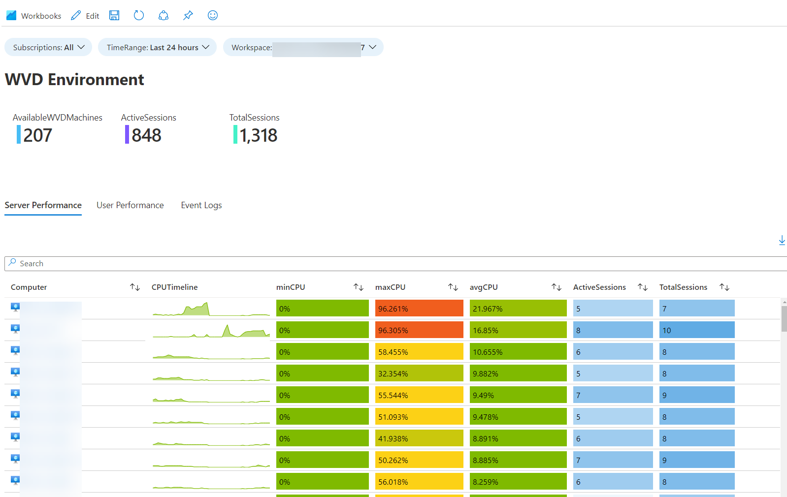
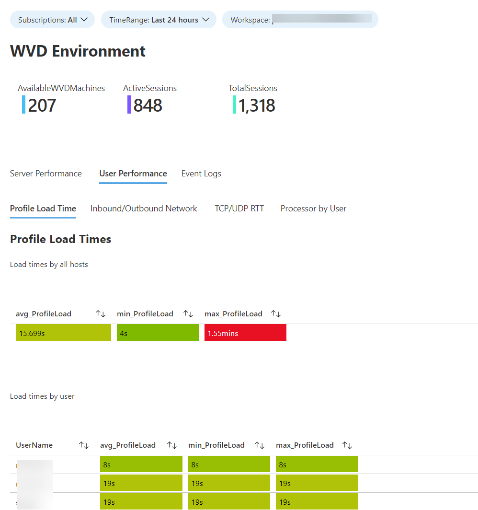
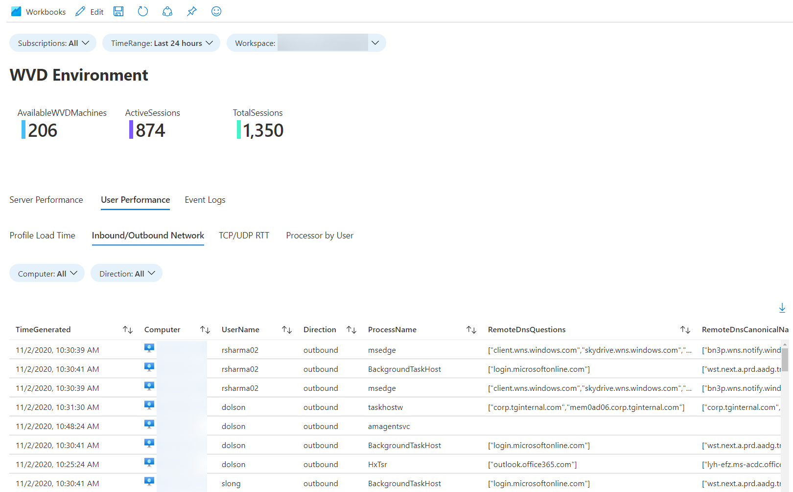
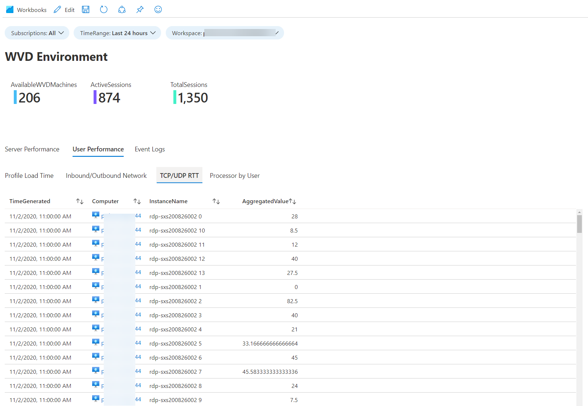
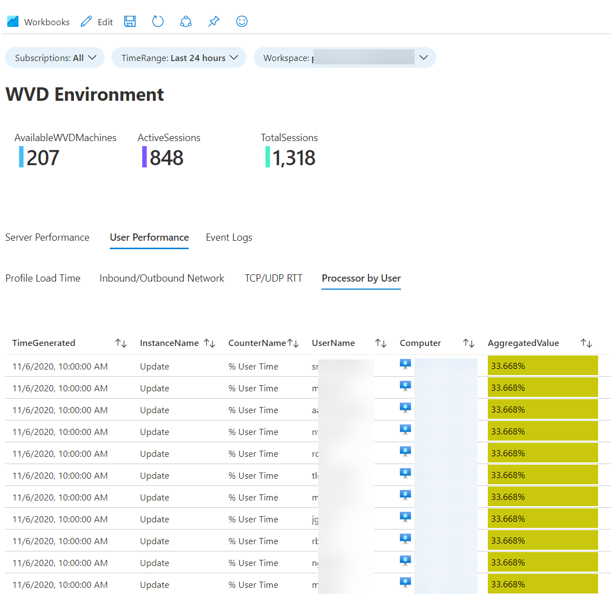
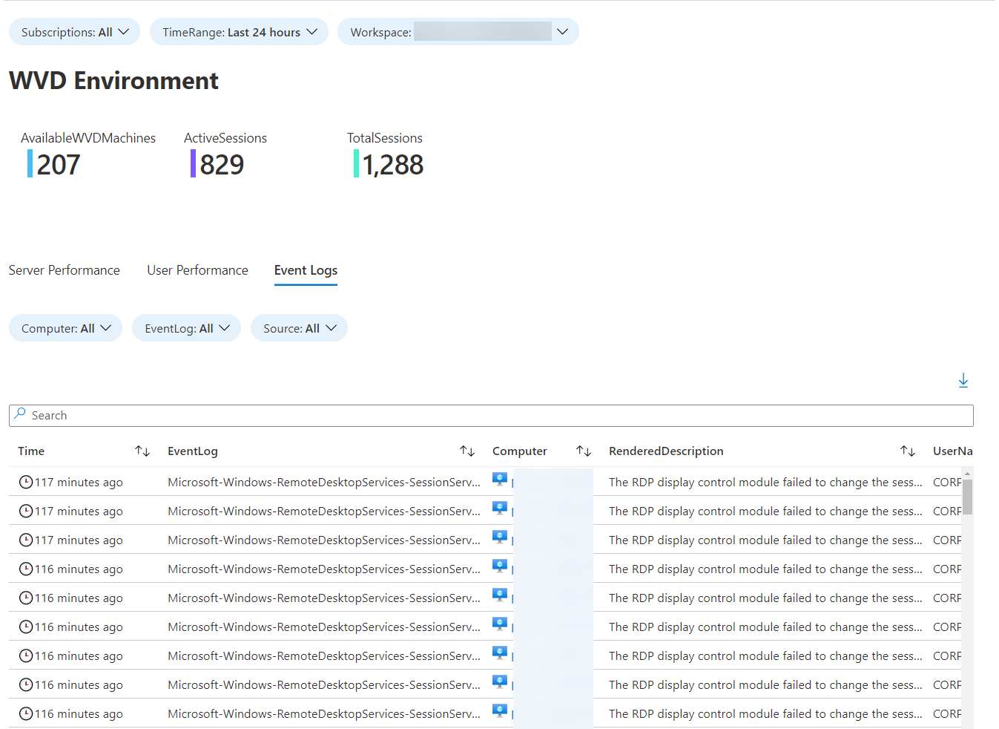

# Windows Virtual Desktop Workbook

## Related blog post
https://www.cloudsma.com/2020/11/wvd-azure-monitor-workbook/

## Requirements
As noted above this WVD Workbook is using exclusively IaaS perf and logging data.

You'll need:

Log Analytics workspace
- Perf Data
    - RemoteFX Graphics(*)\Frames Skipped/Second - Insufficient Server Resources
    - RemoteFX Network(*)\Current TCP RTT
    - RemoteFX Network(*)\Current UDP RTT
    - Terminal Services(*)\Active Sessions
    - Terminal Services(*)\Total Sessions
    - Azure Monitor for VMs* 
- Logs
    - FSLogix-Apps/Operational**
    - Azure Security Center**
    - System
    - Microsoft-Windows-RemoteDesktopServices-SessionServices/Operational
    - WVD Machines reporting to workspace

* Azure Monitor for VMs, I am using the Perf data from InsightsMetrics table as I did not want to double bill the client for these metrics. If you are not using Azure Monitor for VMs you can easily add the same counters I'm using in those queries to your workspace and then modify the queries as needed.

** Azure Security Center and FSLogix, this is for the profile load times tab, if you do not want this information or don't have Azure Security Center, it can be removed.

Additionally, if you have other machines reporting to the workspace that aren't part of you're WVD environment, you'll want to add a filter likely by ResourceGroup in the queries, as all of these queries will bring in machines that aren't related to WVD.

## Workbook Examples

